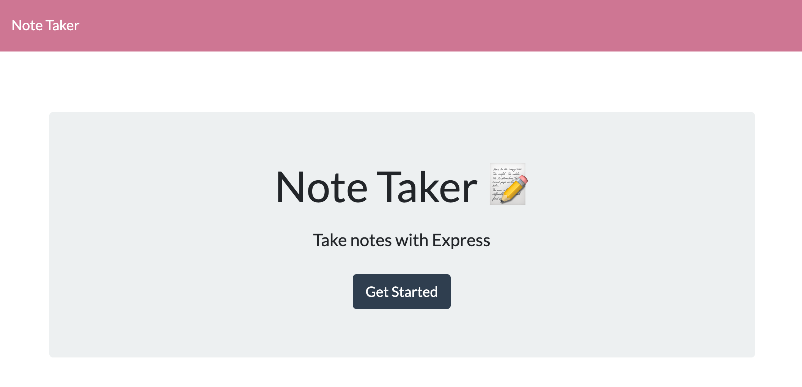
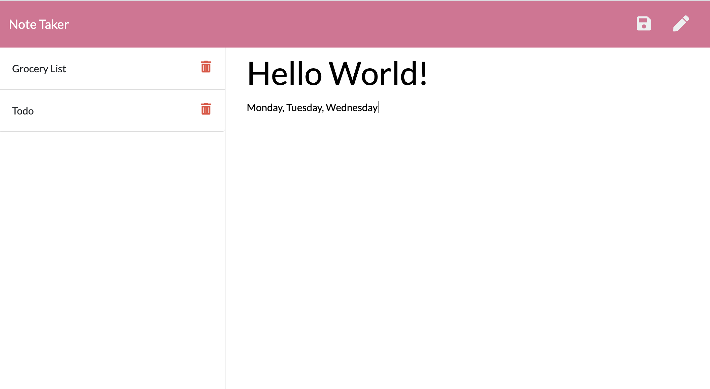

# note-taker

 

## Deployed Link
[Site](https://desolate-sierra-29002.herokuapp.com/)

## Table of Contents
||||
|:-:|:-:|:-:|
|[Table Contents](#table-of-contents)|[Deployed Link](#deployed-link)|[Technologies Used](#technologies-used)
|[Description](#description)|[Work Involved](#work-involved)|[Code Snippet](#code-snippet)
|[Site Picture](#site-picture)|[Authors](#authors)|[Acknowledgments](#acknowledgments)

## Site Picture



## Technologies Used
|||||
|:-:|:-:|:-:|:-:|
|Express	|NodeJS |Javascript |HTML	
|CSS	|Bootstrap |Heroku |Github

## Description
This application allows a user to write, save, and delete notes. 

## Work Involved
For this application, I was provided all of the frontend data, so I focused my efforts on using express in order to build the backend and connect the two. I created HTML routes in order to return both html pages. I also created three API routes in order to save and retrieve the note data from a JSON file. 

## Code Snippet
* This particular API route recieves the new note in order to save on the request body. It then adds it to the db.json file and returns it to the user.
```
app.post("/api/notes", (req, res) => {
    const notes = [];
    var newNote = req.body;
    console.log(newNote);
    notes.push(newNote);
    fs.readFile(path.join(__dirname, "db/db.json"), "utf8", (err, data) => {
        if (err) throw err;
        var newData = JSON.parse(data);
        for (var i = 0; i < newData.length; i++) {
            const noteCard = {
                title: newData[i].title,
                text: newData[i].text,
                id: i + 1,
            };
            notes.push(noteCard);
        }
        fs.writeFile(path.join(__dirname, "db/db.json"), JSON.stringify(notes, null, 10), (err) => {
            if (err) throw err;
            res.json(req.body);
        });
    });
})
```

## License
This project is covered under MIT.

## Authors
**UC Berkeley Coding Bootcamp**

**Jessny Joseph** 

[Github](https://github.com/jessnyj) | [LinkedIn](https://www.linkedin.com/in/jessny-joseph-361515201)

## Acknowledgments
I would like to thank the mentors and colleagues who helped inspire and improve upon this project.
